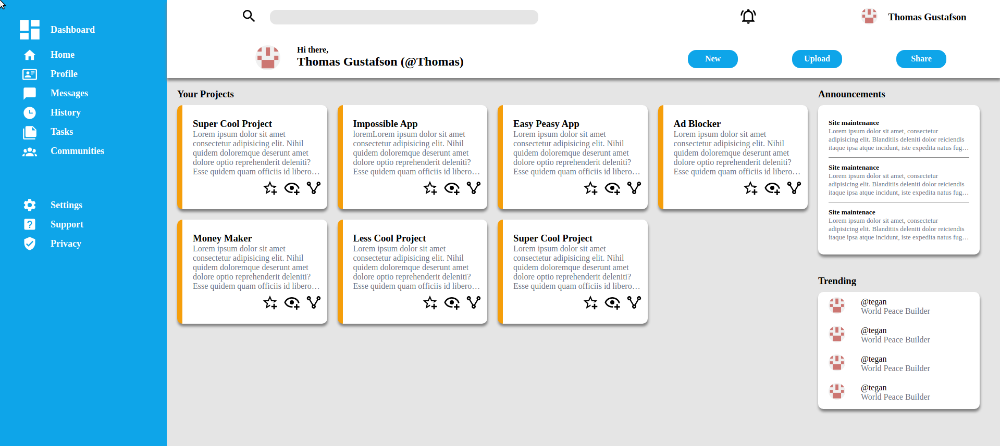

# admin-dashboard

This project will demonstrate my knowledge of HTML/CSS design to make a admin dashboard layout.

It uses a combination of CSS Grid properties, padding, and margin to achieve the layout.
For the main content area it uses CSS functions repeat, auto-fit, and minmax to achieve a dynamic layout that changes based on the window size.
Lastly the main content uses overflow and scroll bar properties to have scroll be only in the project section

For the card containers it takes advantage of webkit to limit the text on each card to a set number of lines

## Narrow Window Layout

## Wider Window Layout

